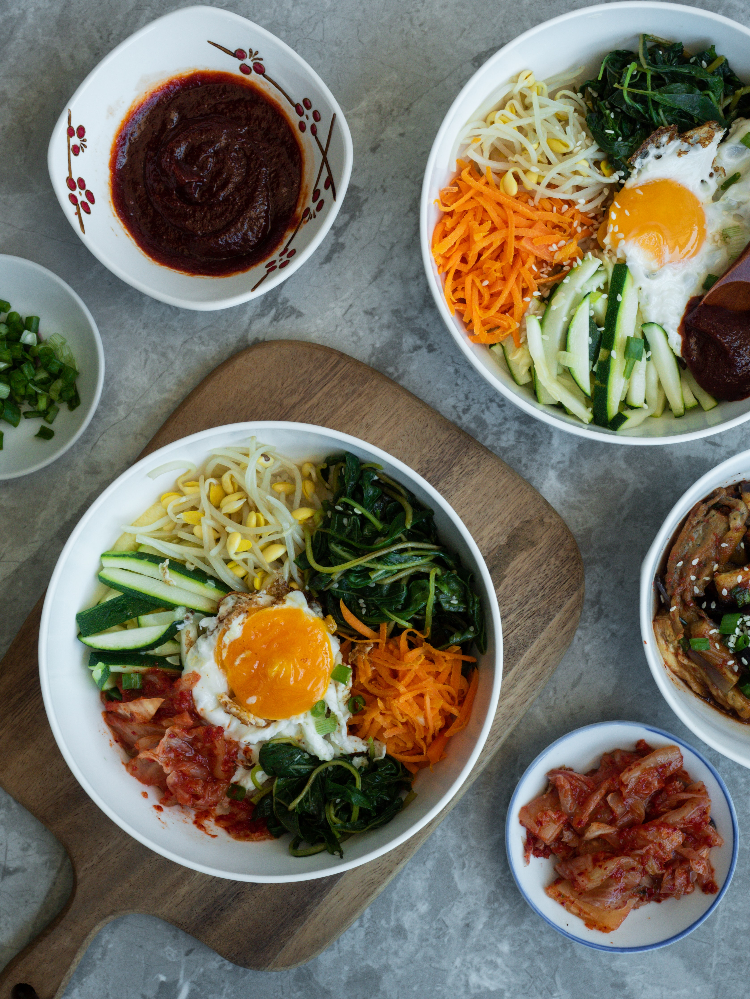

Have you watched *Squid Game* and graved an authentic Korean dish? Bibimbap is a classic Korean dish you might recognise from the show. It translates to 'mixed rice' in English and might be your solution for a healthy and colourful dinner. Even though the recipe contains many ingredients, and a lot of steps, the cooking process is manageable for beginners! So do whip up this dish for your next movie night if you want to impress your friends.

###  **Ingredients**

**For the gochujang sauce**

* 1/4 cup gochujang (Korean chili paste)
* 2 tablespoons toasted sesame oil
* 2 tablespoons sugar
* 2 tablespoons water
* 1 tablespoon toasted sesame seeds
* 2 teaspoons minced garlic
* 2 teaspoons rice vinegar

**For the spicy cucumber namul**

* 12 ounces (4 to 5) Persian cucumbers
* 1/2 teaspoon kosher salt
* 1 large clove of garlic, grated
* 1 (1/2-inch) piece of fresh ginger, grated
* 1 green onion, thinly sliced
* 1 tablespoon rice vinegar
* 1 tablespoon gochugaru (Korean chilli flakes), or to taste
* 1 teaspoon sugar
* 1/2 teaspoon toasted sesame oil

**For the spinach namul**

* 1 1/2 teaspoons kosher salt, divided
* 1 pound baby spinach
* 2 green onions, thinly sliced
* 1 clove garlic, grated
* 1 1/2 teaspoons soy sauce
* 1 1/2 teaspoons toasted sesame oil
* 1 1/2 teaspoons toasted sesame seeds
* 1/4 teaspoon sugar
* 1/8 teaspoon freshly ground black pepper

**For the bean sprout namul**

* 1/2 pound fresh mung bean sprouts
* 1/2 green onion, thinly sliced
* 1 clove garlic, grated
* 1/2 teaspoon grated ginger
* 1 1/2 tablespoons toasted sesame oil
* 1 teaspoon toasted sesame seeds
* 1/2 teaspoon kosher salt

**For the rest of the bibimbap**

* 2 cups short-grain white rice
* 2 1/2 cups water
* 8 ounces boneless steak (such as rib eye or sirloin)
* 1 1/2 tablespoons soy sauce
* 2 teaspoons sugar
* 2 teaspoons toasted sesame oil
* 2 teaspoons mirin
* 1 clove garlic, grated
* 2 tablespoons plus 1 teaspoon neutral oil, such as canola, divided
* 2 small carrots, peeled and [julienned](https://www.simplyrecipes.com/how-to-julienne-carrots-carrot-matchsticks-5525341)
* 6 ounces fresh shiitake mushrooms, stems discarded and caps sliced
* 6 large eggs

##### **Methods**

1. **Make the gochujang sauce:**  Combine all sauce ingredients in a small bowl and whisk until smooth. Cover and refrigerate until ready to use, up to 5 days.
2. **Make the cucumber namul:** Slice the cucumbers thinly, about 1/8 inch thick, and toss with the salt. Set aside for about 30 minutes to allow the salt to draw out excess water.
3. Drain the cucumbers and rinse the salt off. Pat dry with a paper towel, pressing a bit to release any remaining water. 

   
4. Combine with garlic, ginger, green onion, rice vinegar, gochugaru, sugar, and sesame oil. Taste and adjust for salt. Chill and store in a covered container in the fridge for up to a day before serving
5. **Make the spinach namul:**  Bring a large pot of water to a boil and prepare an ice bath. Add 1 teaspoon salt to the boiling water. Blanch the spinach for 30 seconds and use a spider or slotted spoon to transfer it to an ice water bath to stop the cooking.
6. After cooling, drain and squeeze all the liquid out. Combine with the green onions, garlic, soy sauce, sesame oil, sesame seeds, and remaining 1/2 teaspoon salt, sugar, and pepper. Taste and adjust for salt. Chill and store in a covered container in the fridge for up to a day before serving.
7. **Make the bean sprout namul:**  Bring a large pot of water to a boil (you can use the same water you used to blanch the spinach). Blanch the bean sprouts for 3 minutes. Use a spider or slotted spoon to transfer it to an ice bath to stop the cooking. 
8. Drain well and combine with the green onion, garlic, ginger, sesame oil, sesame seeds, and salt. Taste and adjust for salt. Chill and store in a covered container in the fridge for up to a day before serving.
9. **Make the rice**: Add the rice to a medium bowl and cover it with water. Swirl the rice around with your hands a few times. The water will become cloudy as excess starch is washed off. Drain and discard the cloudy water. Add fresh water and repeat at least 3 times, or until the water is mostly clear. Soak the washed rice in fresh water for 30 minutes.
10. Drain the rice and add to a heavy-bottomed pot that is deep enough that your rice won’t boil over, around twice as tall as the water level. Add 2 1/2 cups water. Cover with the lid, turn the heat to medium-high, bring to a boil, and cook for 5 minutes.
11. Reduce the heat to low and simmer until the rice is tender and all the water is absorbed about 15 to 17 minutes. Turn off the heat and let it sit, covered, for 10 minutes. Keep covered to stay warm.

    
12. **Marinate the beef:** Meanwhile, slice the beef into thin, 2-inch long strips. In a medium bowl, combine the soy sauce, sugar, sesame oil, mirin, and garlic and whisk to combine. Add the beef, toss to coat, and marinate for 20 minutes
13. **Sauté the carrots, mushrooms, and beef:** Meanwhile, heat a wok or large, heavy-bottomed skillet over high heat. Add 2 teaspoons of neutral oil and sauté the carrots for 2 to 3 minutes, or until just starting to char and still crisp-tender. Season with salt and remove to a platter. Add another teaspoon of oil to the pan and repeat with shiitake mushrooms.
14. Once the beef has been marinating for 20 minutes, remove it from the marinade, pat it dry, add another teaspoon of oil to the pan, and sauté the beef until browned, 2 to 3 minutes over high heat. Place on the platter with the carrots and mushrooms.
15. **Prepare the eggs (optional):** When almost ready to serve, start cooking your eggs. Add 1 tablespoon of neutral oil to a nonstick skillet set over medium-high heat. Add the eggs and fry, sunny side up, basting the whites with spoonfuls of the hot oil until fully set. 

    
16. **Assemble and serve:** Add the rice to individual bowls. Place each topping in its own sections on top of the rice, leaving an open space in the centre. Place one egg in the centre of each serving. Drizzle with the gochujang sauce.