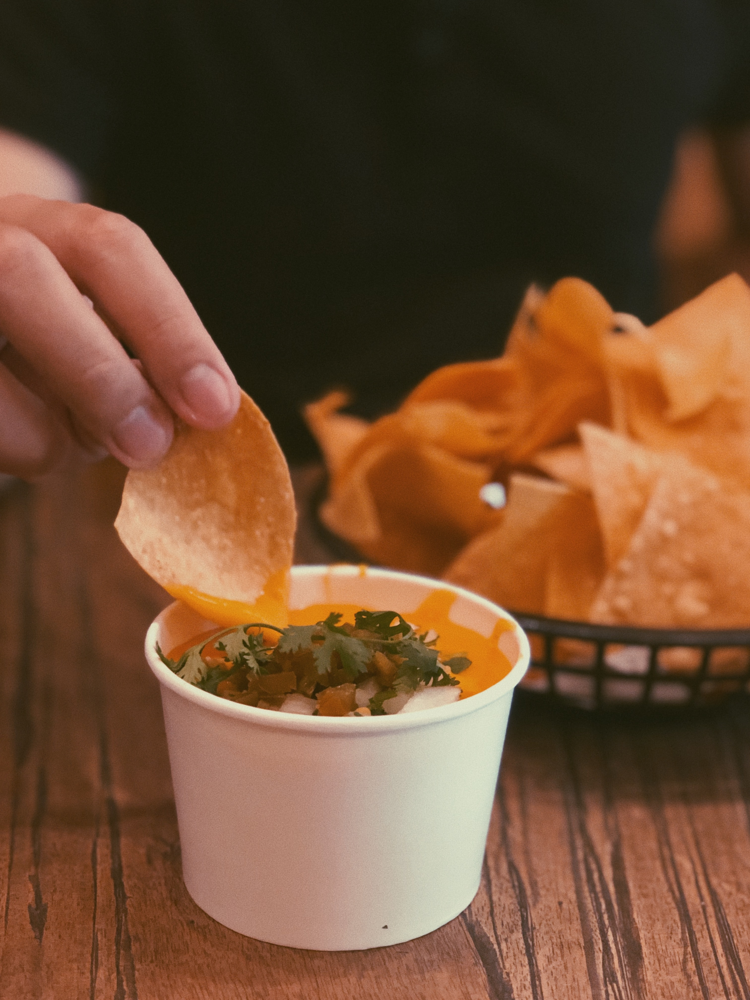

Try this Orange is the new black-inspired Sweet Potatoe White Bean Dip for your next craving in front of the screen. You can eat this dip with veg straws, crisps, bread or breadsticks!

### Ingredients

* 1 pound sweet potatoes
* 2 shallots (about 1/4 pound), cut into 4 pieces each
* 4 tablespoons olive oil, divided
* 1 teaspoon sea salt
* 1 (15-ounce) can (or 1 1/2 cups [cooked](https://www.simplyrecipes.com/recipes/how_to_cook_dried_beans/)) white beans, drained (reserve the liquid) and rinsed
* 1 to 2 chipotles in adobo sauce
* 2 tablespoons lime juice
* 1/4 cup cilantro, plus more for serving

### Methods

1. **Roast the sweet potatoes:** Preheat your oven to 450 ̊F. Peel the sweet potatoes and cut them into 1 1/2-inch cubes. Place both the sweet potatoes and shallots on a rimmed baking sheet and toss with 2 tablespoons of olive oil and sea salt. Roast until the sweet potatoes are tender, about 25 to 30 minutes.
2. **Make the dip:** Place the roasted sweet potatoes and shallots in a food processor or blender along with the white beans, 2 tablespoons olive oil, chipotles, lime juice, and cilantro. Puree, adding reserved bean liquid as needed until the dip is smooth and thick like a hummus would be.
3. **Serve the dip:** Serve immediately or refrigerate until needed; serve at room temperature or cold. Sprinkle the top of the dip with cilantro, and serve with your favourite tortilla chips or an assortment of fresh vegetables.