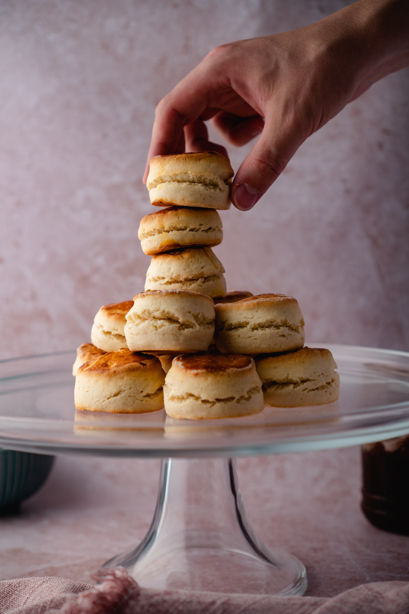

Did you ever feel to have some high tea with perfectly golden scones while watching the Crown? After plenty of scenes when the royal family gets served some perfectly British scones everyone wants to try those. The following is an original and simple scone recipe, perfect with some fresh clotted cream and jam. 

### Ingredients

* 2 cups (257g) all-purpose flour, plus more for dusting surface
* 3 tablespoons (39g) granulated sugar
* 1 tablespoon (15g) baking powder
* 1/2 teaspoon (2g) kosher salt
* 4 tablespoons unsalted butter, frozen
* 2/3 cup plus 1 tablespoon of whole milk, divided
* Clotted cream and jam, for serving (optional)

### Methods

1. **Line a baking sheet:** Line a rimmed baking sheet with parchment paper.
2. **Combine the dry ingredients:** In a large bowl, whisk together the flour, sugar, baking powder, and salt.
3. **Grate the butter:** Place a box grater over the prepared baking sheet. Grate the butter in the large holes of a box grater. When you get down to a small nub of butter, chop that nub into a few small pieces.
4. **Add the butter to the dry ingredients:** Use your fingers to toss the butter in the flour, breaking up any clumps, until evenly coated.
5. **Add milk and form a rough dough ball:** Drizzle about half of the whole milk over the butter-flour mixture. Use a fork or your hands to combine and lightly mix. The mixture will start to look sandy.
6. Add the remaining half of the reserved milk 1 tablespoon at a time, as needed, continuing to combine with a fork or your hands, until a rough and lumpy, but cohesive, dough ball forms. You may not use all the remaining milk.
7. **Shape the dough:** Turn the dough out onto a floured work surface and pat it into a rough 1-inch-thick circle about eight inches in diameter
8. **Cut dough into scone rounds:** Use a 2-inch biscuit cutter to cut the dough into rounds. Cut them as close together as possible. You want to get as many rounds as possible on your first pass through the dough. Gently press the scraps back together and cut out additional rounds. You should have 8 to 10 rounds, depending on how diligent you are with pressing the scrapes together.
9. **Transfer the scones to the prepared baking sheet, refrigerate, and preheat the oven:** Transfer the scone rounds to the prepared baking sheet, spacing them about 1 inch apart. Refrigerate the unbaked scones while you arrange a rack in the middle of the oven and preheat the oven to 400°F.
10. **Brush scones with milk and bake:** Once the oven has preheated, using a pastry brush, brush the scones with the remaining 1 tablespoon of milk and bake until golden brown, 18 to 22 minutes.
11. **Cool and serve scones:** Let the scones cool for 5 minutes on the baking sheet before enjoying warm or transferring them to a cooling rack to cool completely. Serve with clotted cream and jam, if desired